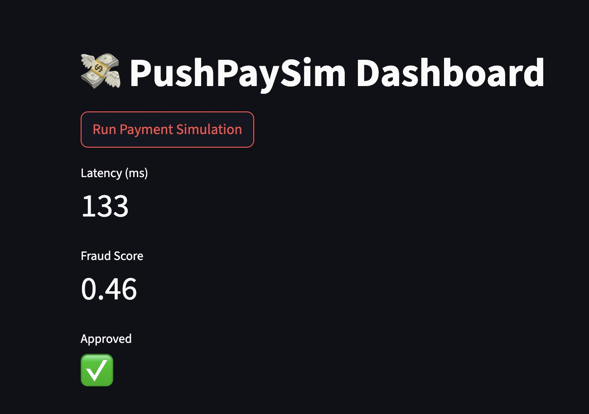

# 🚀 PushPaySim: Real-Time Payments Risk & Latency Simulator

**Ideal for PMs in Payments, Fintech, or Risk Management.**

PushPaySim simulates real-time payment flows and visualizes key metrics like fraud detection, latency, and approval rate. Designed for showcasing decision logic, running fraud algorithm A/B tests, and identifying performance bottlenecks.

---

## 🔍 Features

- 🧪 Mock APIs to simulate instant payments
- 📊 Dashboard to track:
  - Transaction latency
  - Fraud detection accuracy
  - Approval success rate
- 🔀 A/B Testing of fraud detection logic
- 🧠 Optional ML-based fraud scoring (stretch goal)

---

## 🗂️ Project Structure

```bash
pushpaysim/
├── api/              # Backend APIs using FastAPI
├── dashboard/        # Dashboard (Streamlit)
├── tests/            # Simple tests
├── data/             # Sample transaction data
├── experiments/      # A/B testing notebook


## 📸 Screenshots (optional)



